# Pewlett-Hackard-Analysis

## Data Visualization Week 7 Challenge 

## Background
This week's lessons centered around Human Resources data for a large company with a great deal of people aging into retirement.  6 csv files were provided as data to load into the 6 database tables created in PostgreSQL throughout the module for this week.  The data consists of employee information listed in various tables.  The database is built as shown below in the ERD (Fig.1) and then used as a base to demonstrate various SQL query techniques.  

Fig.1 
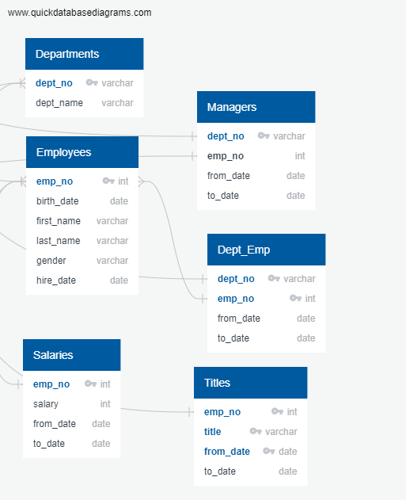 

## Technical Analysis

### Resources
* PostgreSQL / pgAdmin4
* 6 csv files were provided containing various data
* Partitioning query found at [https://blog.theodo.com/2018/01/search-destroy-duplicate-rows-postgresql/](https://blog.theodo.com/2018/01/search-destroy-duplicate-rows-postgresql/)

### Assumptions
* The 3 tables for Deliverable #1 and the table for Deliverable #2 are generated from the original 6 tables loaded with the csv data provided
  * **Current** Employees born between 1/1/1952 and 12/31/1955 (does not contain the same hire date requirement as in the modules)
  * Number of each title retiring
  * Number of current employees with each title (all employees, not just those retiring)
* **Current** Employees means a to_date = '9999-01-01'

### Technical Steps
Note:  All queries can be found in the file: [Challenge7.sql](Queries/Challenge7.sql)

After joining tables (employee, titles, salaries) and filtering to birth dates in 1952-1955 (Fig.2), the instructions in the challenge walk you through the use of partitioning the data to find and remove unwanted duplicate rows (Fig.3).  This method was taken from Daria Khmel's blog post *Search and destroy duplicate rows in PostgreSQL* at the theodo link listed above in the Resources section.  Thanks, Daria!  
The final table for this part is exported to the [Data directory](Data): [deliverable_one_b.csv](Data/deliverable_one_b.csv)

**Fig. 2:** 

**Fig.3:** 

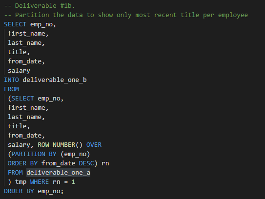

There seems to be a limitation in this method.  This method will provide a list containing the most recent title of the employees born 1952-1955, but only a subset of these employees are current employees.  The list needs to be pared down to only current employees (titles.to_date = 9999-01-01).  However, this cannot be accomplished unless the to_date column is included in the SELECT statement.  When the to_date column is used instead of the from_date column as requested in the challenge instructions, the method works as intended (only showing **current** employees after the partitioning step).  Although, after testing a theory, I found that the same information can be obtained with a simple query without partitioning (Fig.4).  It is my understanding that the challenge instructions are used as a means to teach our class to be careful with regard to duplicate rows and how to use partitioning to overcome this issue. 
This table generated from my method is exported to the [Data directory](Data): [test_one.csv](Data/test_one.csv)

**Fig.4:** 

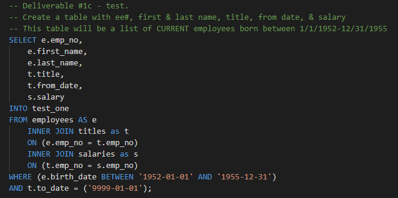

The number of retiring employees by title is obtained with the SELECT COUNT query (Fig.5) on the tables developed above. 
The table from the method in the instructions is exported to the [Data directory](Data):  [retirees_by_title.csv](Data/retirees_by_title.csv) 
The table from my method is exported to the [Data directory](Data):  [retirees_by_title_nick.csv](Data/retirees_by_title_nick.csv)

**Fig.5:** 

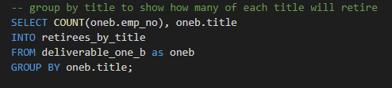

The number of all employees by title is obtained with the SELECT COUNT query (Fig.6) on the original titles table.  Again, denoting current employees by setting the to_date = 9999-01-01. 
This table is exported to the [Data directory](Data):  [all_emps_by_title.csv](Data/all_emps_by_title.csv)

**Fig.6:** 

For Deliverable #2, a list of **current** employees that are eligible for the Mentorship program, we use a similar INNER JOIN as above coupled with the WHERE statements to parse the table to the requested data (Fig.7). 
This table is exported to the [Data directory](Data): [mentorship.csv](Data/mentorship.csv)

**Fig.7:** 

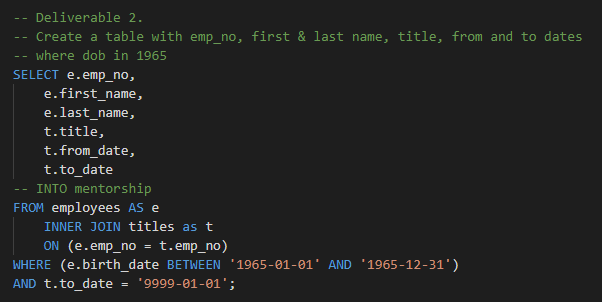

## Results

The total number of **all current** employees is 240,124, broken down by title as shown below in Fig.8. 
This table is exported to the [Data directory](Data):  [all_emps_by_title.csv](Data/all_emps_by_title.csv)

**Fig.8:** 

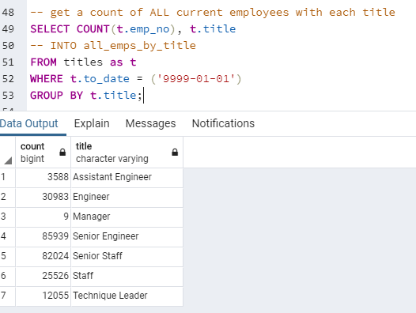

The first method (with the partitioning) gives a total of 90,398 employees born between 1952 and 1955 broken down as shown below in Fig.9. 
This table is exported to the [Data directory](Data):  [retirees_by_title.csv](Data/retirees_by_title.csv)

**Fig.9:** 

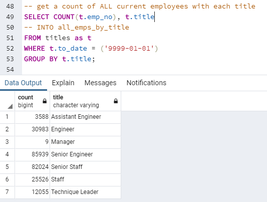
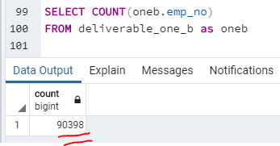

However, as discussed above, I believe this method is not acurate and we should look at only **current** employees (to_date = 9999-01-01).  My method (described above in Technical Steps Section) gives a total of 72,458 retirees broken down as shown below in Fig.10. 
This table is exported to the [Data directory](Data):  [retirees_by_title_nick.csv](Data/retirees_by_title_nick.csv)

**Fig.10:** 

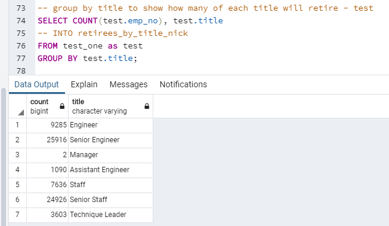
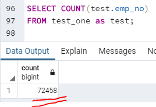

From the mentorship program table we can run a SELECT COUNT statement to get the number of employees that are available for the mentorship role.  The Result is 1,549. 

**Fig.11:** 

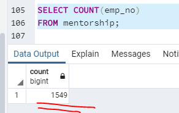

## Recommendations for Further Analysis
In an effort to bolster the mentorship program, I would make queries to the database to find out how many young employeees there are at PH.  Additionally, we can explore how long these employees have been in their current roles and get the potential proteges identified for the potential mentors we have already found.  
