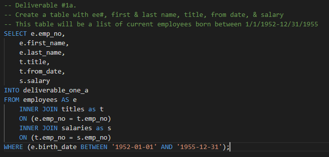

# Pewlett-Hackard-Analysis

## Data Visualization Week 7 Challenge 

## Background
This week's lessons centered around HR data for a large company with a great deal of people aging into retirement.  6 csv files were provided as data to load into the 6 database tables created in PostgreSQL throughout the module for this week.  The data consists of employee information listed in various tables.  The database is built as shown below in the ERD (Fig.1) and then used as a base to demonstrate various SQL query techniques.  

Fig.1 

## Technical Analysis

### Resources
* 6 csv files were provided containing various data
* PostgreSQL / pgAdmin4

### Assumptions
* The 3 tables for Deliverable #1 are generated from the original 6 tables loaded with the csv data
  * Current Employees born between 1/1/1952 and 12/31/1955 (does not contain the same hire date requirement as in the modules)
  * Number of each title retiring
  * Number of current employees with each title (all employees, not just those retiring)

### Technical Steps
After joining tables (employee, titles, salaries) and filtering to birth dates in 1952-1955 (Fig.2), the instructions in the challenge walk you through the use of partitioning the data to find and remove unwanted duplicate rows (Fig.3).  

**Fig. 2:** 

**Fig.3:** 

git 

However, there seems to be a limitation in this method.  Without the highlighted line of code this method will provide a list containing the most recent title of the employees born 1952-1955, but only a subset of these employees are current employees.  The line of code above has been added to pare down the list to only current employees (to_date = 9999-01-01).

After testing a theory, I found that the same information can be obtained with a simple query without partitioning (Fig.4).

**Fig.4:** 

df;

The number of retiring employees by title is obtained with the SELECT COUNT query (Fig.5) on the table developed above. 
This table is exported to:  [retirees_by_title.csv](Data/retirees_by_title.csv)

**Fig.5:** 

The number of all employees by title is obtained with the SELECT COUNT query (Fig.6) on the original titles table.  Again, denoting current employees by setting the to_date = 9999-01-01.  

**Fig.6:** 

## Results

